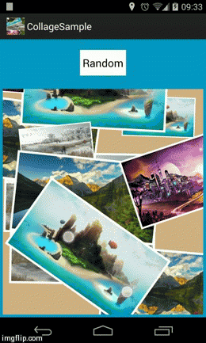
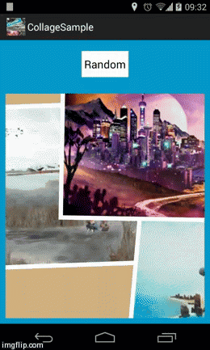
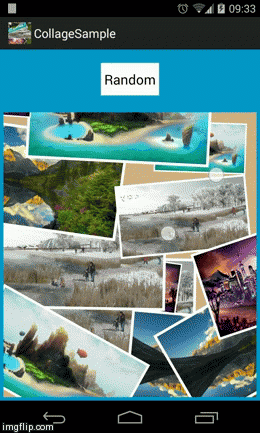

Collage
=============

This library allows you to create a random collage of cards. 

The library allows to create fixed Collage (cards can not be moved, scaled or rotated) 
or dynamic Collage (cards can move, scale and rotate).

Collage is based on library created by <a href="https://github.com/thuytrinh/android-collage-views">thuytrinh</a>






Check CollageSample in 

<a href="https://play.google.com/store/apps/details?id=com.jcmore2.collagesample">
  
</a>

Usage
-----

Add library to your build.gradle:

```java

	    compile 'com.jcmore2.collage:collage:1.0.0'

```

Add CollageView in your xml


```xml

        <com.jcmore2.collage.CollageView
            android:id="@+id/collage"
            android:layout_width="match_parent"
            android:layout_height="match_parent"
            android:layout_margin="10dip" >
        </com.jcmore2.collage.CollageView>

```


Get CollageView in your activity, create a list of images (Bitmaps, Drawables, Resources)
and call 'createCollage'

```java

		CollageView collage = (CollageView) findViewById(R.id.collage);

		List<Integer> listRes = new ArrayList<Integer>();
		listRes.add(R.drawable.img1);
		listRes.add(R.drawable.img2);
		listRes.add(R.drawable.img3);
		listRes.add(R.drawable.img4);
		
		collage.createCollageResources(listRes);
		
```


* You can set Collage fixed

```java

		collage.setFixedCollage(true);
	
```

* or dynamic (default)

```java

		collage.setFixedCollage(false);

	
```


Credits & Contact
-----------------

Collage was created by jcmore2@gmail.com


License
-------

Collage is available under the Apache License, Version 2.0.
